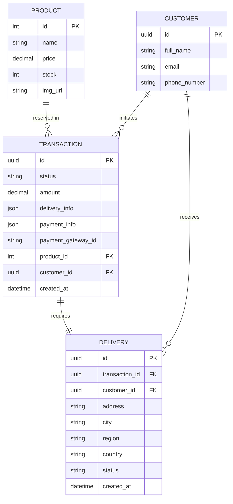

# E-Shop API (Payment Gateway Integration)

A robust backend service built with **NestJS**, designed to handle the core checkout process of an e-commerce platform. It integrates with a **Payment Gateway** to secure and process transactions while managing inventory and delivery synchronization.

## 🚀 Description

This API provides a secure and scalable solution for:
- **Product Management**: Catalog retrieval and real-time stock orchestration.
- **Transaction Lifecycle**: Creation, status polling, and automatic fulfillment updates.
- **Payment Gateway Integration**: Seamless connection with a Payment Gateway for credit card tokenization and secure payment processing.
- **Customer & Delivery Tracking**: Persistent storage of customer profiles and delivery information linked to approved transactions.

## 🏛️ Architecture

The project follows a **Hexagonal Architecture (Ports and Adapters)** and **Domain-Driven Design (DDD)** principles to ensure high maintainability and testability.

- **Domain Layer**: Contains the core business logic (Entities, Interfaces).
- **Application Layer**: Orchestrates the business logic through Use Cases.
- **Infrastructure Layer**: Implements adapters for external services (TypeORM for DB, Wompi Adapter for payments, controllers).

---

## 🛠️ Getting Started

### 1. Project Setup
```bash
$ npm install
```

### 2. Database Migrations
We use TypeORM to manage the database schema. Ensure your environment variables are set before running:

```bash
# Run pending migrations
$ npm run migration:run

# Revert the last migration
$ npm run migration:revert

# Generate a new migration (provide name via --name=MyMigration)
$ npm run migration:generate --name=MyNewTable
```

### 3. Running Locally
```bash
# Development mode with hot-reload
$ npm run start:dev

# Run via Serverless Offline (simulates AWS Lambda)
$ npm run dev:serverless
```

---

## 🧪 Testing

We prioritize code quality with a comprehensive testing suite.

```bash
# Run unit tests
$ npm run test

# Run tests with coverage report
$ npm run test:cov
```

### Coverage Results
| Component | % Stmts | % Branch | % Funcs | % Lines |
| :--- | :---: | :---: | :---: | :---: |
| **Total Logic** | **94.14** | **71.05** | **81.35** | **94.01** |

---

## ☁️ Deployment

The project is configured for **AWS Lambda** via the **Serverless Framework**.

```bash
# Deploy to production stage
$ npm run deploy
```

> [!NOTE]
> The `deploy` script automatically cleans locally, rebuilds, runs migrations, and pushes to AWS us-east-1.

---

## 📊 Data Model



## 📮 API Documentation

A Postman collection is available to test all endpoints:
[Backend.postman_collection.json](../Backend.postman_collection.json)

---

## 🔑 Environment Variables

Required variables in `.env`:
- `DB_HOST`, `DB_PORT`, `DB_USERNAME`, `DB_PASSWORD`, `DB_NAME`
- `PAYMENT_GATEWAY_PUBLIC_KEY`
- `PAYMENT_GATEWAY_PRIVATE_KEY`
- `PAYMENT_GATEWAY_INTEGRITY_SECRET`
- `PAYMENT_GATEWAY_API_URL`
- `FRONTEND_URL`
